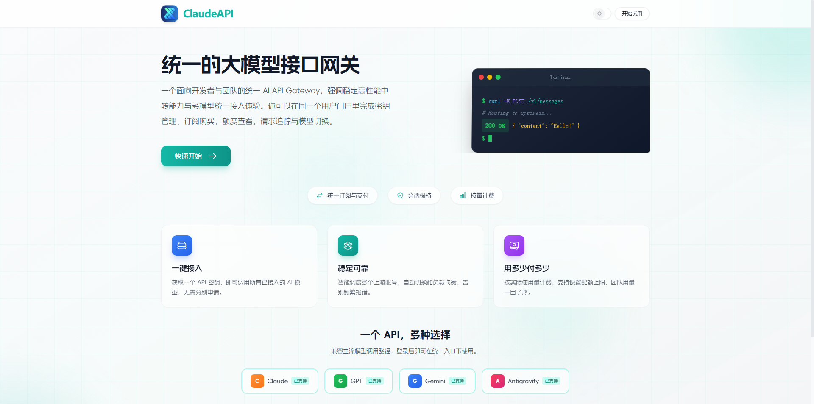
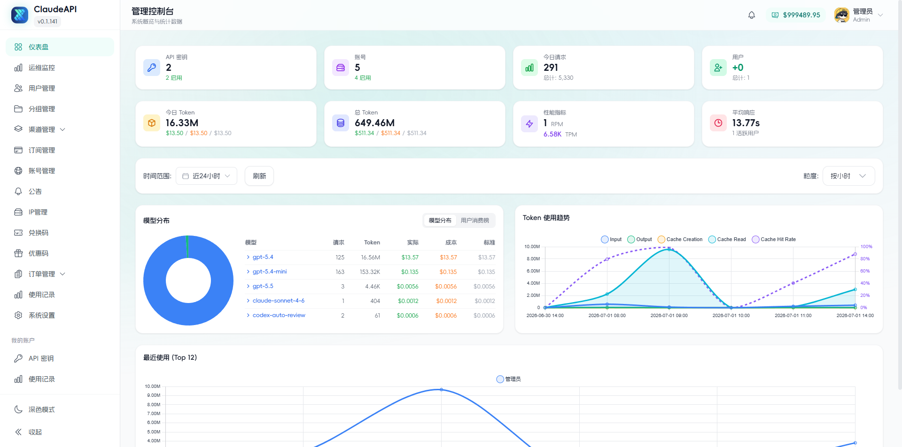
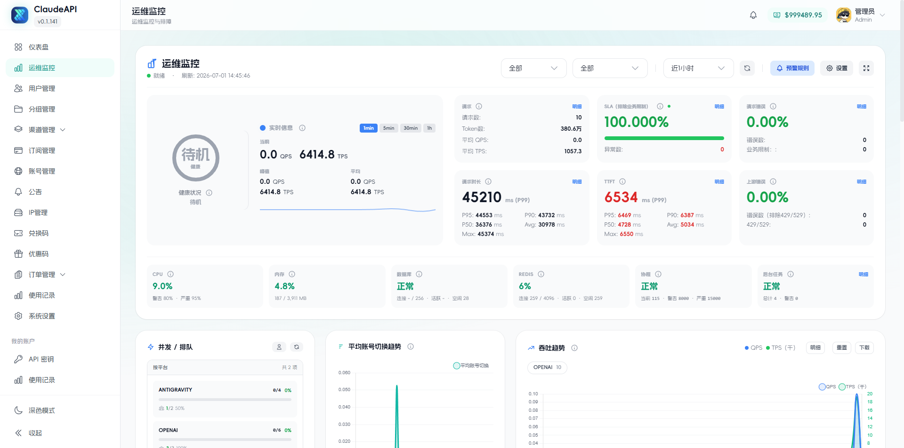

<div align="center">
  

# ClaudeAPI

**统一的大模型 API 网关与运营管理平台**
[](https://codex.48nh.com)
[](backend/cmd/server/VERSION)
[](https://go.dev/)
[](https://vuejs.org/)
[](LICENSE)

[项目仓库](https://github.com/YA52077/ClaudeAPI) · [问题反馈](https://github.com/YA52077/ClaudeAPI/issues) · QQ：`7504544`| QQ 群：`746280829`

</div>

---

## 项目简介

ClaudeAPI 是一个面向个人开发者、团队和 API 运营场景的统一 AI API Gateway。平台将多个上游账号和模型能力集中到一个管理后台，通过统一 API Key 对外提供服务，并负责账号调度、请求转发、故障切换、用量统计、配额与计费管理。

## 核心能力

- **统一 API 接入**：使用一个平台 API Key 接入多种模型和上游账号。
- **多账号池管理**：支持 OAuth、API Key 等账号形态，集中维护账号状态和凭据。
- **智能调度**：提供账号选择、粘性会话、负载均衡、冷却和自动故障切换。
- **协议转换**：支持 Anthropic Messages、OpenAI Responses 等接口形态，并提供 HTTP、SSE 和 WebSocket 链路。
- **精细化运营**：管理用户、分组、API Key、订阅、余额、倍率、配额和并发限制。
- **用量与计费**：记录请求、Token、模型和费用数据，支持用量查询与统计分析。
- **管理与监控**：内置管理控制台、账号状态、渠道监控、系统日志和运营数据面板。
- **安全控制**：提供 JWT、TOTP、会话绑定、敏感操作二次验证、管理审计日志和上游访问控制。
- **异步图片任务**：支持异步图片生成与编辑、任务状态轮询，以及使用 S3 兼容对象存储保存结果；详见 [异步图片任务说明](docs/ASYNC_IMAGE_TASKS.md)。

## 模型与协议

ClaudeAPI 的界面和当前代码包含以下平台能力：

- Claude / Anthropic
- GPT / OpenAI / Codex
- Gemini
- Antigravity
- Grok / xAI

常用接口包括：

| 接口或链路       | 用途                           |
| ---------------- | ------------------------------ |
| `/v1/messages`   | Anthropic Messages 兼容接口    |
| OpenAI Responses | Responses/Codex 请求转发与转换 |
| HTTP / SSE       | 普通请求和流式响应             |
| WebSocket        | OpenAI Responses 长连接场景    |
| `/health`        | 服务健康检查                   |

不同平台、账号类型和模型的功能覆盖可能不同，最终以管理后台可配置项和当前代码实现为准。

## ClaudeAPI 定制

本仓库维护自己的前端产品体验，而不是直接使用上游默认页面：

- ClaudeAPI 品牌、Logo、站点标题和中文文案；
- 中文优先的默认界面；
- 独立设计的首页、登录/注册页和认证布局；
- 自定义字体、色彩、导航栏和响应式终端展示；
- 面向 API Key、账号池、运营监控和管理场景的后台界面；
- 保留上游后端能力更新，同时避免升级覆盖定制页面。

## 界面预览

> 下列截图来自较早的 v0.1.141 界面，仅用于展示整体设计；当前代码版本为 v0.1.157，具体功能和布局以实际部署为准。

### 首页



### 运维监控



### 管理控制台



## 技术栈

| 模块       | 技术                                               |
| ---------- | -------------------------------------------------- |
| 后端       | Go 1.26.5、Gin、Ent、Viper                         |
| 前端       | Vue 3、TypeScript 5.6、Vite 5、Pinia、Tailwind CSS |
| 数据库     | PostgreSQL 18                                      |
| 缓存与协调 | Redis 8                                            |
| 构建与部署 | pnpm 9、Docker、Docker Compose                     |
| 测试       | Go Test、Vitest、Vue Test Utils                    |

生产镜像使用多阶段构建：先编译 Vue 前端，再将前端产物嵌入 Go 二进制，最终通过单个服务提供 API 和 Web 控制台。

## 从源码构建

### 环境要求

- Docker 20.10+
- Docker Compose v2+
- 可用的 PostgreSQL 和 Redis，或使用仓库中的 Compose 服务
- 生产环境所需的安全密钥和数据库密码

### 1. 获取源码

```bash
git clone https://github.com/YA52077/ClaudeAPI.git
cd ClaudeAPI
```

### 2. 构建 ClaudeAPI 镜像

```bash
docker build \
  --build-arg VERSION=0.1.157 \
  -t claudeapi:0.1.157 \
  .
```

### 3. 准备 Compose 配置

```bash
cp deploy/.env.example deploy/.env
```

至少需要在 `deploy/.env` 中设置：

```dotenv
POSTGRES_PASSWORD=请替换为高强度随机密码
JWT_SECRET=请替换为固定的随机密钥
TOTP_ENCRYPTION_KEY=请替换为固定的随机密钥
ADMIN_PASSWORD=请替换为管理员密码
```

然后把 `deploy/docker-compose.yml` 中的应用镜像从：

```yaml
image: weishaw/sub2api:latest
```

改为本地构建的镜像：

```yaml
image: claudeapi:0.1.157
```

启动服务：

```bash
docker compose -f deploy/docker-compose.yml up -d
```

默认访问地址：

```text
http://localhost:8080
```

查看状态和日志：

```bash
docker compose -f deploy/docker-compose.yml ps
docker compose -f deploy/docker-compose.yml logs -f sub2api
```

## 当前部署说明

仓库仍处于从上游技术标识向 ClaudeAPI 独立发布体系迁移的阶段：

- `deploy/docker-compose.yml` 默认仍引用 `weishaw/sub2api:latest`；
- 部分安装和升级脚本仍可能从上游仓库下载发布文件；
- Go module 和最终二进制名称仍保留 `sub2api`；
- 当前仓库尚未把这些兼容标识全部重命名为 `claudeapi`。

如果需要运行本仓库的定制前端，请使用上面的**源码构建镜像**，不要直接把默认上游镜像当作 ClaudeAPI 定制版本。

## 开发与检查

### 前端

```bash
corepack pnpm@9.15.9 --dir frontend install --frozen-lockfile
corepack pnpm@9.15.9 --dir frontend run lint:check
corepack pnpm@9.15.9 --dir frontend run typecheck
corepack pnpm@9.15.9 --dir frontend run test:run
corepack pnpm@9.15.9 --dir frontend run build
```

### 后端

```bash
go -C backend test -tags=unit ./...
go -C backend build ./cmd/server
```

需要 PostgreSQL、Redis 或 Testcontainers 的集成测试应在具备 Docker 环境的机器上运行。

## 项目结构

```text
ClaudeAPI/
├── backend/        # Go 后端、数据库迁移和嵌入式 Web 服务
├── frontend/       # Vue 3 管理后台与用户界面
├── deploy/         # Docker Compose、配置样例和部署脚本
├── img/            # 项目界面截图
├── Dockerfile      # 前后端一体化镜像构建
└── README.md       # 项目说明
```

## 安全提示

- 请遵守所在国家或地区的法律法规以及上游服务商的使用条款。
- 不要提交 API Key、OAuth Token、数据库密码、JWT Secret 或 TOTP 加密密钥。
- 生产环境必须使用固定且足够强的 `POSTGRES_PASSWORD`、`JWT_SECRET` 和 `TOTP_ENCRYPTION_KEY`。
- 建议通过 HTTPS 反向代理对外提供服务，并限制数据库和 Redis 的公网访问。
- 修改 URL allowlist、HTTP 上游或响应头过滤策略前，请评估 SSRF、明文传输和敏感信息泄露风险。
- 升级前请备份 PostgreSQL 数据库，并关注数据库迁移日志。

## 反馈与交流

- GitHub：<https://github.com/YA52077/ClaudeAPI>
- Issues：<https://github.com/YA52077/ClaudeAPI/issues>
- QQ ：`7504544`
- QQ 群：`746280829`

提交问题时，请提供脱敏后的版本号、部署方式、错误日志和复现步骤。请勿公开发送任何账号凭据或密钥。

---

<div align="center">
  <strong>ClaudeAPI · 一个 API，多种选择</strong>
</div>
